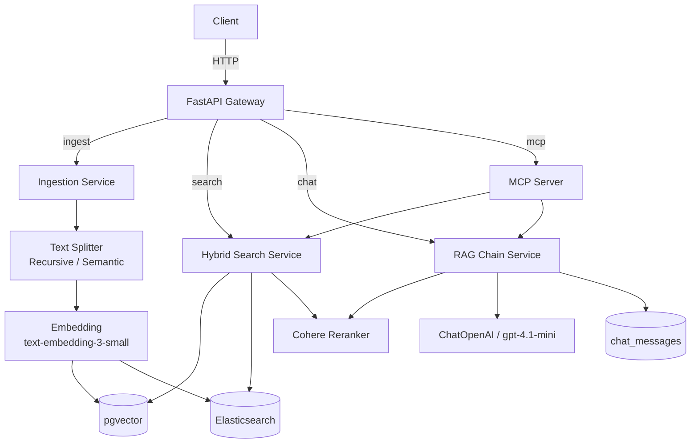

# 🤖 KnowledgeForge

> Plataforma enterprise de gestión de conocimiento potenciada por IA. Ingiere documentos, los indexa con búsqueda híbrida (Elasticsearch + pgvector) y genera respuestas fundamentadas con RAG — todo expuesto nativamente vía MCP.

[](.)
[](.)
[](.)

---

## 🎯 Visión general

KnowledgeForge consolida cuatro capacidades críticas en una sola plataforma:

| Módulo | Origen conceptual | Qué resuelve |
|--------|------------------|--------------|
| **Ingesta + Chunking** | DataHarvest pattern | Procesa PDFs, Markdown, HTML de forma asíncrona |
| **Búsqueda Híbrida** | SearchMaster | Elasticsearch BM25 + pgvector semántico con reranking |
| **RAG Conversacional** | ConversAI + DocuMind | Q&A con fuentes citadas y memoria de sesión |
| **Servidor MCP** | MCPForge | Expone `search_knowledge` / `summarize_doc` como tools nativas |

---

## 🛠️ Tecnologías principales

| Categoría | Tecnología | Versión objetivo |
|-----------|-----------|-----------------|
| Backend | FastAPI con `lifespan` async | 0.115+ |
| ORM / DB | SQLAlchemy async + Alembic | 2.0+ |
| Vectores | pgvector (extensión PostgreSQL) | 0.7+ |
| Búsqueda | Elasticsearch | 8.x |
| LLM / RAG | LangChain LCEL + `create_retrieval_chain` | 0.3+ |
| Embeddings | `text-embedding-3-small` (OpenAI) | — |
| MCP | `mcp` SDK Python | 1.x |
| Testing | pytest + Testcontainers (PG + ES) | — |

---

## 🏗️ Arquitectura



### Patrones clave

- **Layered Architecture**: `router → service → repository → schema`
- **Lifespan context manager** (FastAPI 0.115+): inicializa conexiones a ES y PG al arranque
- **LCEL RAG chain** (LangChain 0.3):
  ```python
  # Patrón actual: create_retrieval_chain + LCEL
  chain = (
      {"context": retriever | format_docs, "question": RunnablePassthrough()}
      | ChatPromptTemplate.from_messages([("system", SYSTEM_PROMPT), ("human", "{question}")])
      | ChatOpenAI(model="gpt-4.1-mini")
      | StrOutputParser()
  )
  ```
- **BackgroundTasks** con DI (FastAPI) para procesamiento asíncrono de documentos sin bloquear el request:
  ```python
  @router.post("/documents")
  async def upload_document(
      file: UploadFile,
      background_tasks: BackgroundTasks,
      ingestion_svc: Annotated[IngestionService, Depends()],
  ):
      background_tasks.add_task(ingestion_svc.process, file)
      return {"status": "queued"}
  ```

---

## ✅ Definition of Done

- [ ] **API First**: contrato OpenAPI definido en `docs/openapi.yaml` antes de codificar
- [ ] **Ingesta asíncrona**: endpoint `POST /documents` con `BackgroundTasks`
- [ ] **Búsqueda híbrida**: combinar score pgvector + BM25 con Reciprocal Rank Fusion (RRF)
- [ ] **RAG con fuentes**: respuesta incluye `sources: [{doc_id, chunk_index, score}]`
- [ ] **Servidor MCP**: tools `search_knowledge(query)` y `summarize_document(doc_id)`
- [ ] **Tests de integración**: Testcontainers para PostgreSQL + Elasticsearch
- [ ] **Memoria de sesión**: `chat_messages` persiste el historial por `session_id`
- [ ] **Docker Compose**: PG (con pgvector), Elasticsearch, app levantados con un comando

---

## 📐 Endpoints principales

```
POST   /documents                → Ingesta + chunking (async)
GET    /documents/{id}           → Estado del documento
DELETE /documents/{id}           → Eliminar doc y sus chunks

POST   /search                   → Búsqueda híbrida (body: {query, k, filters})
GET    /search/suggest           → Autocompletado (Elasticsearch suggest)

POST   /chat                     → RAG Q&A (body: {session_id, question})
GET    /chat/{session_id}/history → Historial de la sesión

GET    /mcp/tools                → Lista las tools MCP disponibles
```

---

## 🗄️ Esquema de base de datos

```sql
-- Documentos ingestados
CREATE TABLE documents (
    id           UUID PRIMARY KEY DEFAULT gen_random_uuid(),
    filename     TEXT NOT NULL,
    content_hash TEXT NOT NULL UNIQUE,  -- deduplicación
    status       TEXT DEFAULT 'pending', -- pending | processing | ready | failed
    uploaded_at  TIMESTAMPTZ DEFAULT now()
);

-- Chunks con embeddings
CREATE TABLE document_chunks (
    id           UUID PRIMARY KEY DEFAULT gen_random_uuid(),
    document_id  UUID REFERENCES documents(id) ON DELETE CASCADE,
    chunk_index  INT NOT NULL,
    content      TEXT NOT NULL,
    embedding    vector(1536),           -- text-embedding-3-small
    metadata     JSONB DEFAULT '{}'
);
CREATE INDEX ON document_chunks USING ivfflat (embedding vector_cosine_ops);

-- Sesiones y mensajes de chat
CREATE TABLE chat_sessions (
    id         UUID PRIMARY KEY DEFAULT gen_random_uuid(),
    created_at TIMESTAMPTZ DEFAULT now()
);

CREATE TABLE chat_messages (
    id           UUID PRIMARY KEY DEFAULT gen_random_uuid(),
    session_id   UUID REFERENCES chat_sessions(id) ON DELETE CASCADE,
    role         TEXT NOT NULL CHECK (role IN ('user', 'assistant')),
    content      TEXT NOT NULL,
    context_used JSONB DEFAULT '[]',    -- chunks usados como contexto
    created_at   TIMESTAMPTZ DEFAULT now()
);
```

---

<details>
<summary>📚 Referencias de documentación usada</summary>

- [FastAPI BackgroundTasks + DI](https://fastapi.tiangolo.com/tutorial/background-tasks)
- [FastAPI Dependencies with yield](https://fastapi.tiangolo.com/tutorial/dependencies/dependencies-with-yield)
- [LangChain LCEL create_retrieval_chain](https://docs.langchain.com/oss/python)
- [pgvector ivfflat index](https://github.com/pgvector/pgvector)
- [MCP Python SDK](https://modelcontextprotocol.io/docs/sdk/python)

</details>
