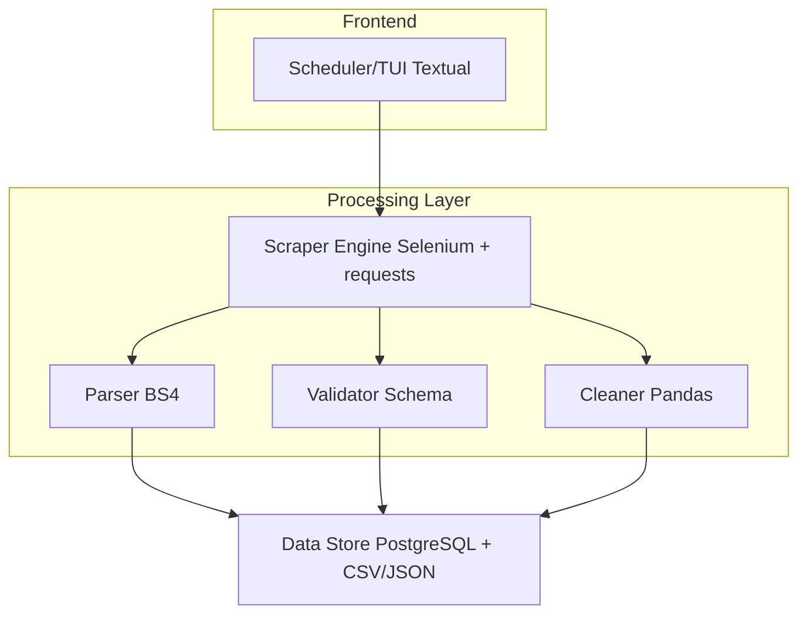

# 🕷️ Semana 03 — DataHarvest

> **Web scraper inteligente con Selenium, Pandas y análisis automatizado de datos**

| Campo              | Detalle             |
| ------------------ | ------------------- |
| 📅 Fechas          | 21-22 de marzo 2026                               |
| 🏷️ Categoría       | Backend Foundations                               |
| ⏱️ Tiempo estimado | 10-12 horas                                       |
| 📊 Dificultad      | ⭐⭐⭐ Intermedio                                 |
| 🔗 Repositorio     | [GitHub](https://github.com/artur282/DataHarvest) |

---

## 🎯 Descripción

DataHarvest es un web scraper robusto y ético que recolecta datos de fuentes públicas (por ejemplo, datos de mercado, empleos tech, o noticias), los procesa con Pandas y los almacena de forma estructurada. Incluye manejo de errores, retries, rotación de user-agents, y exportación a múltiples formatos.

Este proyecto sienta las bases para los proyectos de datos del mes de mayo.

---

## 🏗️ Arquitectura



---

## ✨ Features

### Scraping

- [x] Motor de scraping con Selenium (páginas dinámicas)
- [x] Fallback a requests + BeautifulSoup (páginas estáticas)
- [x] Rotación de user-agents
- [x] Manejo de rate limiting y delays éticos
- [x] Retry con backoff exponencial
- [x] Respeto de robots.txt

Extra implementado:

- [x] Scraper real de Python Jobs con metadata (`posted_at`, `tags`)
- [x] Scraper real de Hacker News con metadata (`points`, `author`, `comments_count`, `item_url`)

### Procesamiento de datos

- [x] Limpieza y normalización con Pandas
- [x] Validación de schema de datos
- [x] Deduplicación inteligente
- [x] Transformaciones personalizables
- [x] Detección de anomalías básicas

### Almacenamiento y exportación

- [x] Persistencia en PostgreSQL
- [x] Exportación a CSV, JSON, Excel
- [x] Historial de ejecuciones
- [x] Logs detallados de cada run

Extra implementado:

- [x] Registro de runs con `status=success/error` y `error_message`
- [x] Registro de duración por ejecución (`duration_seconds`)
- [x] Filtros de historial por scraper/status
- [x] Paginación de historial (next/prev)
- [x] Exportación CSV de historial filtrado con columnas derivadas (`duration_seconds`, `has_error`)

### TUI y configuración

- [x] Interfaz TUI con Textual para ejecutar scrapers
- [x] Configuración por YAML/TOML
- [x] Modo dry-run para testing
- [x] Reporte de resultados en pantalla
- [x] Run-all desde la interfaz

---

## 🛠️ Stack técnico

| Tecnología         | Propósito                         |
| ------------------ | --------------------------------- |
| **Selenium**       | Scraping de páginas dinámicas     |
| **BeautifulSoup4** | Parsing HTML                      |
| **Pandas**         | Procesamiento y limpieza de datos |
| **PostgreSQL**     | Almacenamiento persistente        |
| **SQLAlchemy**     | ORM                               |
| **Textual**        | Interfaz TUI                      |
| **Docker Compose** | Infraestructura                   |
| **pytest**         | Testing                           |

---

## 📁 Estructura del proyecto

```text
dataharvest/
├── app/
│   ├── __init__.py
│   ├── tui.py                 # Entry point TUI
│   ├── pipeline.py            # Run single / run all
│   ├── config.py              # Configuración
│   ├── scrapers/
│   │   ├── base.py            # Clase base de scraper
│   │   ├── jobs_scraper.py    # Scraper de empleos tech
│   │   └── news_scraper.py    # Scraper de noticias
│   ├── processors/
│   │   ├── cleaner.py         # Limpieza de datos
│   │   ├── validator.py       # Validación de schema
│   │   └── transformer.py     # Transformaciones
│   ├── storage/
│   │   ├── database.py        # PostgreSQL
│   │   └── exporters.py       # CSV, JSON, Excel
│   └── utils/
│       ├── user_agents.py     # Rotación UA
│       └── retry.py           # Retry logic
├── tests/
│   ├── test_scrapers.py
│   ├── test_processors.py
│   └── fixtures/              # HTML de ejemplo para tests
├── config/
│   └── scrapers.yml           # Configuración de scrapers
├── docker-compose.yml
├── Makefile
├── pyproject.toml
└── README.md
```

---

## 🗓️ Plan del fin de semana

### Sábado

| Hora           | Actividad                                          |
| -------------- | -------------------------------------------------- |
| 🌅 9:00-10:00  | Setup del proyecto, Docker, dependencias           |
| 🌅 10:00-12:00 | Clase base de scraper + Selenium setup             |
| 🌞 12:00-13:00 | Primer scraper funcional (empleos tech)            |
| 🌞 14:00-16:00 | Procesadores: limpieza, validación, transformación |
| 🌆 16:00-18:00 | Almacenamiento en PostgreSQL + exportadores        |

### Domingo

| Hora           | Actividad                                   |
| -------------- | ------------------------------------------- |
| 🌅 9:00-10:30  | TUI con Textual + configuración YAML        |
| 🌅 10:30-12:00 | Segundo scraper (noticias tech)             |
| 🌞 13:00-14:30 | Tests con fixtures HTML                     |
| 🌞 14:30-16:00 | User-agent rotation, retries, rate limiting |
| 🌆 16:00-17:00 | README y documentación                      |

---

## ✅ Definición de "hecho"

- [x] Al menos 2 scrapers funcionales
- [x] Pipeline: scraping → limpieza → validación → almacenamiento
- [x] Exportación a CSV y JSON
- [x] TUI funcional con acciones claras (run, run-all, filtros, export)
- [x] Tests con HTML fixtures (sin depender de internet)
- [x] Manejo de errores y retries
- [x] README con instrucciones y ejemplos

---

## 💼 Lo que demuestra al reclutador

| Habilidad    | Evidencia                            |
| ------------ | ------------------------------------ |
| Web scraping | Selenium + BS4 + manejo robusto      |
| Datos        | Pandas, limpieza, validación         |
| Diseño       | Patrón base class, plugins, SOLID    |
| Ética        | Respeto de robots.txt, rate limiting |
| Testing      | Tests sin dependencias externas      |
