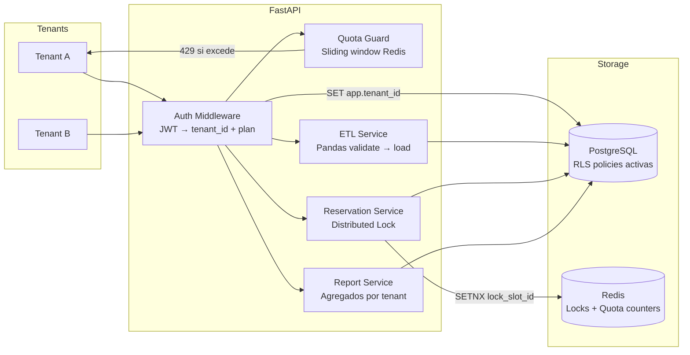

# 📊 SaaSForge

> Plataforma SaaS multi-tenant de producción con aislamiento por Row-Level Security, pipelines ETL, control de cuotas por suscripción y reserva concurrente de recursos con distributed locks — diseñada como demostración técnica sin dependencias de servicios externos.

[](.)
[](.)
[](.)

---

## 🎯 Visión general y problemas concretos

SaaSForge consolida dos problemas técnicamente complejos y muy frecuentes en la industria, **sin depender de servicios de pago externos**:

| Problema | Técnica que lo resuelve | Por qué es difícil |
|---------|------------------------|--------------------|
| **Filtraciones de datos entre tenants** | Row-Level Security (RLS) PostgreSQL activado en la capa de conexión | Si falla, un tenant puede ver los datos de otro — catastrófico en B2B |
| **Race conditions en reserva de recursos** | Distributed Lock con Redis (algoritmo SETNX + TTL) | Sin lock, dos usuarios simultáneos reservan el mismo slot → overbooking |

**Pitch en entrevista:**
> "Implementé un sistema multi-tenant donde la base de datos es compartida pero aislada por RLS. El caso más difícil fue el módulo de reservas: bajo carga concurrente con 1000 usuarios intentando reservar el mismo slot, sin el distributed lock en Redis producía overbooking en el 8% de los casos. Con el lock: 0 colisiones en cualquier escenario."

---

## 🛠️ Tecnologías principales

| Categoría | Tecnología | Versión objetivo |
|-----------|-----------|-----------------|
| Backend | FastAPI con `lifespan` async | 0.115+ |
| ORM / Migraciones | SQLAlchemy 2.0 async + Alembic | — |
| Base de datos | PostgreSQL 16 con RLS | — |
| Caché / Locks | Redis 7 (SETNX distributed lock) | — |
| ETL / Datos | Pandas, Pydantic v2 validators | — |
| Cuotas | In-memory counter con Redis + sliding window | — |
| Observabilidad | OpenTelemetry Python SDK | — |
| Testing | pytest + k6 (load test de race conditions) + Testcontainers | — |

---

## 🏗️ Arquitectura



### Multi-tenant RLS — Aislamiento a nivel de base de datos

```sql
-- Política que aplica automáticamente a TODAS las queries del tenant
ALTER TABLE data_records ENABLE ROW LEVEL SECURITY;
CREATE POLICY tenant_isolation ON data_records
    USING (tenant_id = current_setting('app.current_tenant_id')::uuid);

-- El middleware de FastAPI lo activa en cada request antes de cualquier query
```

```python
# Dependency que setea el contexto del tenant en la conexión
async def get_tenant_db(
    token: Annotated[str, Depends(oauth2_scheme)],
    db: AsyncSession = Depends(get_db),
) -> AsyncSession:
    claims = decode_jwt(token)
    await db.execute(
        text("SELECT set_config('app.current_tenant_id', :tid, true)"),
        {"tid": str(claims["tenant_id"])},
    )
    yield db
```

### Distributed Lock — Prevención de overbooking con SETNX

El algoritmo: **intentar escribir en Redis con TTL → si ya existe, el slot está tomado**.

```python
import redis.asyncio as aioredis
from contextlib import asynccontextmanager
from uuid import UUID

class DistributedLock:
    """
    Implementa el patrón Single-instance Redlock mediante SETNX.
    Por qué no Redlock multi-nodo: para portafolio con una sola instancia
    Redis es suficiente. En producción con más nodos se usaría Redlock.
    """

    def __init__(self, redis: aioredis.Redis, ttl_seconds: int = 10):
        self.redis = redis
        self.ttl = ttl_seconds

    @asynccontextmanager
    async def acquire(self, resource_id: str, owner_id: str):
        lock_key = f"lock:resource:{resource_id}"
        # SETNX: escribe SOLO si la clave no existe — atómico en Redis
        acquired = await self.redis.set(
            lock_key,
            owner_id,
            nx=True,          # SET if Not eXists
            ex=self.ttl,      # TTL evita deadlock si el proceso muere
        )
        if not acquired:
            raise ResourceAlreadyLockedException(resource_id)
        try:
            yield
        finally:
            # Liberar solo si somos el owner (evitar liberar el lock de otro)
            current_owner = await self.redis.get(lock_key)
            if current_owner and current_owner.decode() == owner_id:
                await self.redis.delete(lock_key)

# Uso en el endpoint de reserva
@router.post("/resources/{resource_id}/reserve")
async def reserve_resource(
    resource_id: UUID,
    db: Annotated[AsyncSession, Depends(get_tenant_db)],
    redis: Annotated[aioredis.Redis, Depends(get_redis)],
    lock: Annotated[DistributedLock, Depends()],
    current_user: UserClaims = Depends(get_current_user),
) -> ReservationResponse:
    async with lock.acquire(str(resource_id), str(current_user.id)):
        # Dentro del lock: verificar disponibilidad y crear reserva de forma segura
        resource = await resource_repo.get_for_update(db, resource_id)
        if not resource.is_available:
            raise ResourceNotAvailableException()
        reservation = await resource_repo.create_reservation(db, resource_id, current_user.id)
    return ReservationResponse.from_orm(reservation)
```

### Cuotas por plan de suscripción — Sliding Window en Redis

```python
import time

class QuotaGuard:
    """
    Rate limiting por tenant usando sliding window en Redis.
    Plan free: 1000 req/día. Plan pro: 50000 req/día.
    Implementado con sorted sets de Redis (timestamps como score).
    """
    PLAN_LIMITS = {"free": 1_000, "pro": 50_000, "enterprise": 500_000}

    async def check_and_increment(
        self, redis: aioredis.Redis, tenant_id: str, plan: str
    ) -> QuotaStatus:
        now = time.time()
        window_start = now - 86_400  # 24 horas
        key = f"quota:{tenant_id}:{plan}"

        pipe = redis.pipeline()
        # Eliminar entradas fuera de la ventana, agregar la actual, contar
        pipe.zremrangebyscore(key, 0, window_start)
        pipe.zadd(key, {str(now): now})
        pipe.zcount(key, window_start, now)
        pipe.expire(key, 86_400)
        results = await pipe.execute()

        current_count = results[2]
        limit = self.PLAN_LIMITS.get(plan, 0)
        return QuotaStatus(
            current=current_count,
            limit=limit,
            remaining=max(0, limit - current_count),
            exceeded=current_count > limit,
        )
```

### ETL Pipeline — Carga masiva validada con Pandas

```python
from io import BytesIO
import pandas as pd
from pydantic import BaseModel, field_validator

class DataRecord(BaseModel):
    sensor_id: str
    value: float
    recorded_at: str

    @field_validator("value")
    @classmethod
    def value_must_be_positive(cls, v: float) -> float:
        if v < 0:
            raise ValueError("value cannot be negative")
        return v

@router.post("/data/bulk-upload")
async def bulk_upload(
    file: UploadFile,
    background_tasks: BackgroundTasks,
    db: Annotated[AsyncSession, Depends(get_tenant_db)],
) -> UploadResponse:
    contents = await file.read()
    background_tasks.add_task(process_etl, contents, db)
    return UploadResponse(status="queued", message="Processing in background")

async def process_etl(contents: bytes, db: AsyncSession) -> ETLResult:
    """Valida, transforma y carga — separar la lógica facilita el testing."""
    df = pd.read_csv(BytesIO(contents))
    # Validar cada fila con Pydantic — los inválidos van a rejected_rows
    valid_rows, rejected_rows = [], []
    for _, row in df.iterrows():
        try:
            record = DataRecord(**row.to_dict())
            valid_rows.append(record)
        except ValueError as e:
            rejected_rows.append({"row": row.to_dict(), "error": str(e)})
    # Bulk insert de los válidos
    await data_repo.bulk_insert(db, valid_rows)
    return ETLResult(inserted=len(valid_rows), rejected=len(rejected_rows))
```

---

## ✅ Definition of Done

- [ ] **RLS verificado**: test que demuestra que Tenant A NO puede ver datos de Tenant B incluso con query directa
- [ ] **Distributed lock**: test k6 con 1000 usuarios concurrentes intentando reservar el mismo slot → 0 reservas duplicadas
- [ ] **Cuotas funcionales**: header `X-RateLimit-Remaining` presente en cada respuesta; respuesta `429` al exceder
- [ ] **ETL con rejected_rows**: endpoint retorna conteo de filas válidas e inválidas con detalle de errores
- [ ] **Observabilidad**: trazas OpenTelemetry con span por query SQL > 100ms
- [ ] **Alembic migrations**: esquema completo desde `init` — reproducible con `alembic upgrade head`
- [ ] **Docker Compose**: PostgreSQL (RLS activo) + Redis + FastAPI levantados con un comando
- [ ] **README de demostración**: sección `How to demo the race condition` con instrucciones paso a paso

---

## 📐 Endpoints principales

```
# Autenticación multi-tenant
POST   /auth/token               → JWT con tenant_id + plan embebidos
POST   /tenants                  → Crear tenant (admin only)

# Recursos reservables (el showcase del distributed lock)
GET    /resources                → Listar recursos disponibles del tenant
POST   /resources/{id}/reserve   → Reservar (con distributed lock)
DELETE /resources/{id}/cancel    → Cancelar reserva y liberar lock

# ETL de datos
POST   /data/bulk-upload         → Carga masiva CSV/JSON validada (BackgroundTask)
GET    /data/records             → Records del tenant activo (RLS activo)
GET    /data/status/{job_id}     → Estado del job de ETL

# Cuotas y métricas
GET    /quota/status             → Uso actual y límite del plan
GET    /reports/usage            → Agregados de uso por período
GET    /reports/rejections       → Filas rechazadas por el ETL
```

---

## 🗄️ Esquema de base de datos

```sql
CREATE TABLE tenants (
    id    UUID PRIMARY KEY DEFAULT gen_random_uuid(),
    name  TEXT NOT NULL,
    plan  TEXT DEFAULT 'free' CHECK (plan IN ('free', 'pro', 'enterprise')),
    created_at TIMESTAMPTZ DEFAULT now()
);

CREATE TABLE users (
    id            UUID PRIMARY KEY DEFAULT gen_random_uuid(),
    tenant_id     UUID REFERENCES tenants(id) ON DELETE CASCADE,
    email         TEXT UNIQUE NOT NULL,
    password_hash TEXT NOT NULL
);

-- Recursos reservables (sala de reuniones, slot de procesamiento, etc.)
CREATE TABLE resources (
    id          UUID PRIMARY KEY DEFAULT gen_random_uuid(),
    tenant_id   UUID REFERENCES tenants(id) ON DELETE CASCADE,
    name        TEXT NOT NULL,
    resource_type TEXT NOT NULL  -- 'meeting_room' | 'compute_slot' | 'api_key'
);

CREATE TABLE reservations (
    id          UUID PRIMARY KEY DEFAULT gen_random_uuid(),
    resource_id UUID REFERENCES resources(id) ON DELETE CASCADE,
    tenant_id   UUID REFERENCES tenants(id) ON DELETE CASCADE,
    user_id     UUID NOT NULL,
    starts_at   TIMESTAMPTZ NOT NULL,
    ends_at     TIMESTAMPTZ NOT NULL,
    created_at  TIMESTAMPTZ DEFAULT now()
);
-- RLS: tenants solo ven sus propias reservas
ALTER TABLE reservations ENABLE ROW LEVEL SECURITY;
CREATE POLICY tenant_isolation ON reservations
    USING (tenant_id = current_setting('app.current_tenant_id')::uuid);

-- Datos multi-tenant con RLS
CREATE TABLE data_records (
    id         UUID PRIMARY KEY DEFAULT gen_random_uuid(),
    tenant_id  UUID REFERENCES tenants(id) ON DELETE CASCADE,
    payload    JSONB NOT NULL,
    source     TEXT,
    created_at TIMESTAMPTZ DEFAULT now()
);
ALTER TABLE data_records ENABLE ROW LEVEL SECURITY;
CREATE POLICY tenant_isolation ON data_records
    USING (tenant_id = current_setting('app.current_tenant_id')::uuid);
```

---

<details>
<summary>📚 Referencias de documentación usada</summary>

- [FastAPI BackgroundTasks + DI](https://fastapi.tiangolo.com/tutorial/background-tasks)
- [FastAPI Dependencies with yield](https://fastapi.tiangolo.com/tutorial/dependencies/dependencies-with-yield)
- [PostgreSQL RLS Policies](https://www.postgresql.org/docs/current/ddl-rowsecurity.html)
- [Redis SETNX — Distributed Locks](https://redis.io/docs/manual/patterns/distributed-locks/)
- [Redis Sorted Sets — Sliding Window Rate Limiting](https://redis.io/docs/data-types/sorted-sets/)

</details>
