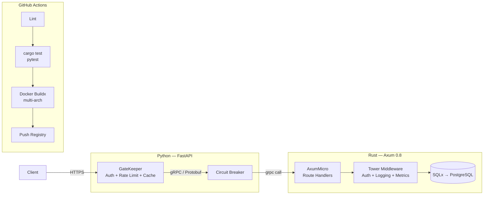

# ☁️ MicroGate

> Plataforma de microservicios polyglot con API Gateway en Python, microservicio Rust ultra-ligero (~25MB), comunicación gRPC y CI/CD completo con GitHub Actions.

[](.)
[](.)
[](.)

---

## 🎯 Visión general

MicroGate demuestra dominio completo de arquitecturas cloud-native combinando Python y Rust en un monorepo coordinado:

| Módulo | Origen conceptual | Qué demuestra |
|--------|------------------|--------------|
| **GateKeeper** (Python) | GateKeeper | API Gateway: rate limiting Redis, circuit breaker, auth central |
| **AxumMicro** (Rust) | AxumMicro | Microservicio Distroless ~25MB con Axum 0.8 |
| **ProtoLink** | ProtoLink | Contrato gRPC/Protobuf compartido Python ↔ Rust |
| **ShipIt** | ShipIt | GitHub Actions: lint → test → build → push multi-arch |

---

## 🛠️ Tecnologías principales

| Categoría | Tecnología | Versión objetivo |
|-----------|-----------|-----------------|
| Gateway | FastAPI + `slowapi` / Redis | 0.115+ |
| Microservicio | Rust + Axum | 0.8.x |
| Async runtime | Tokio | 1.x |
| Comunicación IPC | tonic (gRPC) + prost (Protobuf) | — |
| Caché / Rate limit | Redis 7 | — |
| Resiliencia | `circuitbreaker` pattern (Python) | — |
| CI/CD | GitHub Actions + Docker Buildx | — |
| Contenedores | Distroless (`gcr.io/distroless/cc-debian12`) | — |

---

## 🏗️ Arquitectura



### Axum 0.8 — Middleware con `from_fn`

La versión actual de Axum (0.8.x) usa `middleware::from_fn` para auth. El último extractor debe implementar `FromRequest`:

```rust
use axum::{middleware, extract::Request, http::{HeaderMap, StatusCode}};

// Middleware de autenticación usando from_fn (Axum 0.8.8)
async fn auth_middleware(
    headers: HeaderMap,
    request: Request,
    next: middleware::Next,
) -> Result<axum::response::Response, StatusCode> {
    match extract_bearer_token(&headers) {
        Some(token) if is_valid_jwt(token) => Ok(next.run(request).await),
        _ => Err(StatusCode::UNAUTHORIZED),
    }
}

let app = Router::new()
    .route("/api/v1/process", post(process_handler))
    .route_layer(middleware::from_fn(auth_middleware));
```

### WebSocket en Axum 0.8 — `WebSocketUpgrade` extractor

```rust
use axum::{
    extract::ws::{WebSocketUpgrade, WebSocket},
    routing::any,
    response::Response,
    Router,
};

let app = Router::new().route("/ws/metrics", any(ws_handler));

async fn ws_handler(ws: WebSocketUpgrade) -> Response {
    ws.on_upgrade(handle_metrics_socket)
}

async fn handle_metrics_socket(mut socket: WebSocket) {
    loop {
        let metrics = collect_metrics();
        if socket.send(Message::Text(metrics.to_json())).await.is_err() {
            break; // cliente desconectó
        }
        tokio::time::sleep(Duration::from_secs(1)).await;
    }
}
```

### Definición Protobuf compartida

```protobuf
// proto/service.proto — compilado por AMBOS lados (tonic + grpcio)
syntax = "proto3";

package microgate.v1;

service ProcessorService {
    rpc Process (ProcessRequest) returns (ProcessResponse);
    rpc HealthCheck (HealthRequest) returns (HealthResponse);
}

message ProcessRequest {
    string payload = 1;
    map<string, string> metadata = 2;
}

message ProcessResponse {
    string result = 1;
    int64 latency_ms = 2;
}
```

### Docker multi-stage Distroless

```dockerfile
# --- Builder ---
FROM rust:1.82-slim AS builder
WORKDIR /app
COPY . .
RUN cargo build --release --bin axum-micro

# --- Runtime: sin OS, solo el binario ---
FROM gcr.io/distroless/cc-debian12
COPY --from=builder /app/target/release/axum-micro /axum-micro
EXPOSE 50051
ENTRYPOINT ["/axum-micro"]
# Resultado: ~24MB imagen final
```

---

## ✅ Definition of Done

- [ ] **Proto compartido**: un solo `service.proto` generando código Python y Rust con `buf generate`
- [ ] **Circuit Breaker**: si AxumMicro no responde en >500ms, el gateway retorna `503` inmediatamente
- [ ] **Rate limiting por IP**: 100 req/min en Redis, retorna `429 Too Many Requests` con `Retry-After`
- [ ] **Auth centralizada**: el gateway valida JWT; el microservicio Rust confía en header interno propagado
- [ ] **Imagen Distroless**: `docker build` produce imagen <30MB verificada con `docker inspect`
- [ ] **CI/CD**: GitHub Actions en PR ejecuta `cargo clippy`, `cargo test`, `pytest`, y push al registry
- [ ] **Health check**: `GET /gateway/health` retorna latencia a Redis y al microservicio Rust

---

## 📐 Endpoints principales

```
# Gateway (Python — FastAPI)
GET    /gateway/health           → Estado: Redis latency + Axum latency
POST   /gateway/process          → Traduce JSON → gRPC → retorna resultado
GET    /gateway/metrics          → Prometheus metrics

# AxumMicro (Rust — Axum 0.8, solo accesible vía gateway)
POST   /process                  → Lógica de negocio
GET    /ws/metrics               → WebSocket streaming de métricas del proceso
GET    /health                   → liveness probe
```

---

<details>
<summary>📚 Referencias de documentación usada</summary>

- [Axum 0.8.8 — `middleware::from_fn`](https://docs.rs/axum/0.8.8/axum/middleware/fn.from_fn.html)
- [Axum 0.8.8 — `WebSocketUpgrade` extractor](https://docs.rs/axum/0.8.8/axum/extract/ws/index.html)
- [tonic — gRPC for Rust](https://github.com/hyperium/tonic)
- [prost — Protobuf for Rust](https://github.com/tokio-rs/prost)
- [Distroless containers](https://github.com/GoogleContainerTools/distroless)

</details>
