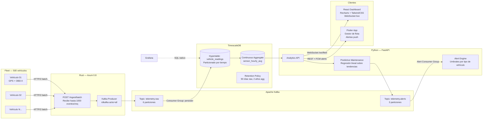

# 🚗 IoTStream

> Plataforma de telemetría vehicular end-to-end: Rust/Axum ingesta miles de eventos por segundo desde sensores simulados, Kafka los distribuye, TimescaleDB los persiste con compresión automática, FastAPI expone analytics predictivos — y React + Flutter visualizan todo en tiempo real.

[](.)
[](.)
[](.)
[](.)

---

## 🎯 Visión general y problema concreto

**Problema real:** Una empresa con 500 vehículos (motos, camiones) necesita monitorear RPM, temperatura de motor, coordenadas GPS y nivel de combustible cada segundo por vehículo. Eso son **500 eventos/segundo sostenidos**, con picos de 5000/s cuando todos arrestan el motor. Python bajo carga directa empieza a perder eventos. El sistema necesita cero pérdida de datos y alertas de mantenimiento preventivo antes de que una pieza falle.

**Por qué esta arquitectura importa en una entrevista:**
> "Los sensores no esperan. Si tu endpoint de ingesta tiene 200ms de latencia bajo carga, estás perdiendo datos de telemetría. Rust me da sub-5ms p99 sin GC pauses, y Python hace lo que mejor sabe: analytics estadísticos sobre datos ya persistidos."

| Capa | Rol | Lenguaje |
|------|-----|----------|
| **Ingesta HTTP** | Recibe batches de eventos de los sensores vía HTTP/2 | Rust (Axum 0.8) |
| **Message Broker** | Buffer distribuido, garantiza exactly-once delivery | Kafka |
| **Persistencia** | Time-series con compresión nativa y aggregates automáticos | TimescaleDB |
| **Analytics API** | Cálculo de mantenimiento preventivo, alertas, dashboards | Python (FastAPI) |

---

## 🛠️ Tecnologías principales

| Categoría | Tecnología | Justificación de elección |
|-----------|-----------|--------------------------|
| Ingesta | Rust + Axum 0.8 | <5ms p99 bajo 5k req/s concurrentes |
| Kafka client Rust | `rdkafka` (librdkafka binding) | Producer de alto throughput con acks=all |
| Broker | Apache Kafka 3.x | Retention configurable, consumer groups, exactly-once |
| Time-series DB | TimescaleDB sobre PostgreSQL | Continuous aggregates, compresión nativa, retention policies |
| Analytics | FastAPI + Pandas + SQLAlchemy async | Queries complejas sobre agregados, endpoints REST |
| Dashboard web | React 18 + Recharts + TailwindCSS | Mapa GPS live, gráficas de telemetría via WebSocket |
| App móvil | Flutter + Dart | App del gestor de flota: alertas push, vista de vehículo |
| Observabilidad | Grafana (datasource: TimescaleDB) | Series temporales históricas para operaciones |
| Testing | `cargo bench` + k6 (load test) | Benchmark de throughput documentado |

---

## 🏗️ Arquitectura



### Rust — Endpoint de ingesta de alta frecuencia (Axum 0.8)

```rust
use axum::{extract::State, http::StatusCode, Json};
use rdkafka::producer::{FutureProducer, FutureRecord};
use serde::{Deserialize, Serialize};

#[derive(Debug, Deserialize)]
pub struct TelemetryBatch {
    pub vehicle_id: String,
    pub readings: Vec<SensorReading>,
}

#[derive(Debug, Deserialize, Serialize)]
pub struct SensorReading {
    pub timestamp_unix_ms: i64,
    pub rpm: f32,
    pub engine_temp_c: f32,
    pub speed_kmh: f32,
    pub fuel_pct: f32,
    pub lat: f64,
    pub lon: f64,
}

/// Handler: recibe batch, serializa a Avro/JSON, publica en Kafka
/// Latencia objetivo: <10ms p99 bajo 5000 req/s
pub async fn ingest_batch(
    State(producer): State<Arc<FutureProducer>>,
    Json(batch): Json<TelemetryBatch>,
) -> Result<StatusCode, StatusCode> {
    let payload = serde_json::to_vec(&batch).map_err(|_| StatusCode::BAD_REQUEST)?;

    // Publicar en Kafka con acks=all garantiza que no se pierde ningún evento
    producer
        .send(
            FutureRecord::to("telemetry.raw")
                .key(&batch.vehicle_id)
                .payload(&payload),
            rdkafka::util::Timeout::Never,
        )
        .await
        .map_err(|_| StatusCode::SERVICE_UNAVAILABLE)?;

    Ok(StatusCode::ACCEPTED)
}
```

### Kafka — Producer de alta confiabilidad (Python — simulador de flota)

```python
from kafka import KafkaProducer
import json, time, random, math

# Producer con exactly-once semantics
producer = KafkaProducer(
    bootstrap_servers=["localhost:9092"],
    value_serializer=lambda v: json.dumps(v).encode("utf-8"),
    key_serializer=lambda k: k.encode("utf-8"),
    acks="all",             # Espera confirmación de todas las réplicas
    enable_idempotence=True,
    retries=5,
    compression_type="snappy",  # Reducción de ~60% en tamaño
    batch_size=16384,
    linger_ms=10,           # Batching: espera 10ms para llenar el batch
)

def simulate_vehicle(vehicle_id: str) -> dict:
    """Simula lecturas OBD-II con degradación realista."""
    return {
        "vehicle_id": vehicle_id,
        "timestamp_unix_ms": int(time.time() * 1000),
        "rpm": 800 + random.gauss(0, 50) + math.sin(time.time()) * 200,
        "engine_temp_c": 90 + random.gauss(0, 2),
        "speed_kmh": max(0, random.gauss(60, 20)),
        "fuel_pct": max(0, 100 - (time.time() % 3600) / 36),
        "lat": 10.480594 + random.gauss(0, 0.01),
        "lon": -66.903603 + random.gauss(0, 0.01),
    }
```

### TimescaleDB — Hypertable + Continuous Aggregates + Retention

```sql
-- Hypertable: particionado automático por tiempo (chunks de 1 día)
CREATE TABLE vehicle_readings (
    time          TIMESTAMPTZ NOT NULL,
    vehicle_id    TEXT NOT NULL,
    rpm           FLOAT4,
    engine_temp_c FLOAT4,
    speed_kmh     FLOAT4,
    fuel_pct      FLOAT4,
    lat           FLOAT8,
    lon           FLOAT8
);

SELECT create_hypertable('vehicle_readings', 'time',
    chunk_time_interval => INTERVAL '1 day'
);

-- Índice compuesto para queries por vehículo/tiempo
CREATE INDEX ON vehicle_readings (vehicle_id, time DESC);

-- Compresión nativa: ~95% reducción de espacio en chunks > 7 días
ALTER TABLE vehicle_readings SET (
    timescaledb.compress,
    timescaledb.compress_orderby = 'time DESC',
    timescaledb.compress_segmentby = 'vehicle_id'
);
SELECT add_compression_policy('vehicle_readings', INTERVAL '7 days');

-- Continuous Aggregate: promedio horario pre-calculado
CREATE MATERIALIZED VIEW vehicle_readings_hourly
WITH (timescaledb.continuous) AS
SELECT
    time_bucket('1 hour', time) AS hour,
    vehicle_id,
    AVG(rpm)           AS avg_rpm,
    MAX(engine_temp_c) AS max_temp,
    AVG(speed_kmh)     AS avg_speed,
    MIN(fuel_pct)      AS min_fuel,
    COUNT(*)           AS sample_count
FROM vehicle_readings
GROUP BY hour, vehicle_id;

SELECT add_continuous_aggregate_policy(
    'vehicle_readings_hourly',
    start_offset     => INTERVAL '3 hours',
    end_offset       => INTERVAL '1 hour',
    schedule_interval => INTERVAL '1 hour'
);

-- Retention: raw data 90 días, aggregates se mantienen 2 años
SELECT add_retention_policy('vehicle_readings', INTERVAL '90 days');
```

### FastAPI — Analytics predictivo de mantenimiento

```python
from fastapi import FastAPI, Depends
from sqlalchemy.ext.asyncio import AsyncSession
import numpy as np

@router.get("/vehicles/{vehicle_id}/maintenance-forecast")
async def predict_maintenance(
    vehicle_id: str,
    db: AsyncSession = Depends(get_db),
) -> MaintenanceForecastResponse:
    """
    Predice próxima revisión usando regresión lineal sobre tendencia
    de temperatura del motor. Si la pendiente supera 0.5°C/día → alerta.
    """
    # Query sobre el aggregate pre-calculado (sub-ms response time)
    rows = await db.execute(
        text("""
            SELECT hour, avg_rpm, max_temp, avg_speed
            FROM vehicle_readings_hourly
            WHERE vehicle_id = :vid
              AND hour > NOW() - INTERVAL '30 days'
            ORDER BY hour
        """),
        {"vid": vehicle_id},
    )
    data = rows.fetchall()

    temps = np.array([r.max_temp for r in data])
    timestamps = np.arange(len(temps))

    # Regresión lineal: slope = °C por hora
    slope, _ = np.polyfit(timestamps, temps, 1)
    days_to_alert = max(0, (95 - temps[-1]) / (slope * 24)) if slope > 0 else None

    return MaintenanceForecastResponse(
        vehicle_id=vehicle_id,
        current_avg_temp=float(temps[-1]),
        temp_trend_c_per_day=float(slope * 24),
        estimated_days_to_maintenance=days_to_alert,
        alert_level="HIGH" if slope > 0.5 else "NORMAL",
    )
```

---

## ✅ Definition of Done

- [ ] **Benchmark documentado**: `k6 run --vus 500 --duration 60s` sobre el endpoint Rust → throughput + p99 registrado en `docs/benchmark.md`
- [ ] **Exactly-once Kafka**: producer con `enable_idempotence=True` y `acks=all`; test de reintentos
- [ ] **Out-of-order handling**: el consumer de Kafka maneja eventos con timestamp pasado (sensores offline que reconectan)
- [ ] **Continuous aggregates corriendo**: `vehicle_readings_hourly` auto-refreshing visible en Grafana
- [ ] **Compresión activa**: `timescaledb_information.chunks` muestra chunks comprimidos post 7 días
- [ ] **Mantenimiento predictivo**: endpoint calcula y persiste alertas en tabla `maintenance_alerts`
- [ ] **React Dashboard**: mapa GPS en tiempo real (React-Leaflet), gráficas de RPM/temp/fuel con Recharts actualizadas via WebSocket, panel de alertas activas — demostrable con `npm run dev`
- [ ] **Flutter App**: pantalla de lista de vehículos, detalle con métricas en tiempo real (polling 5s), badge de alerta cuando `alert_level = HIGH`
- [ ] **Simulador realista**: generador de datos con dropout simulado (vehículos que se desconectan), late events y spikes de temperatura que representan fallas reales
- [ ] **Docker Compose completo**: Rust ingester + Kafka + Zookeeper + TimescaleDB + FastAPI + Grafana (React se sirve con `npm run dev` en desarrollo)

---

<details>
<summary>📐 Endpoints Analytics API (FastAPI)</summary>

```
GET  /vehicles                              → Lista vehículos de la flota
GET  /vehicles/{id}/realtime               → Última lectura del vehículo
GET  /vehicles/{id}/history                → Serie histórica (from/to)
GET  /vehicles/{id}/maintenance-forecast   → Predicción de mantenimiento
GET  /fleet/alerts                         → Alertas activas de toda la flota
GET  /fleet/heatmap                        → Distribución geográfica (lat/lon agg)
POST /ingest/batch                         → Batch ingesta (Rust endpoint)
```

</details>

<details>
<summary>📚 Referencias de documentación usada</summary>

- [TimescaleDB — `create_hypertable`](https://github.com/timescale/timescaledb)
- [TimescaleDB — Continuous Aggregates](https://github.com/timescale/timescaledb/blob/main/README.md)
- [TimescaleDB — Compression + Retention Policies](https://context7.com/timescale/timescaledb/llms.txt)
- [kafka-python — KafkaProducer async, acks=all, batching](https://context7.com/dpkp/kafka-python/llms.txt)
- [Axum 0.8 — State extractor + handlers](https://docs.rs/axum/0.8.8/axum/)
- [rdkafka — Rust Kafka client](https://docs.rs/rdkafka/latest/rdkafka/)

</details>
