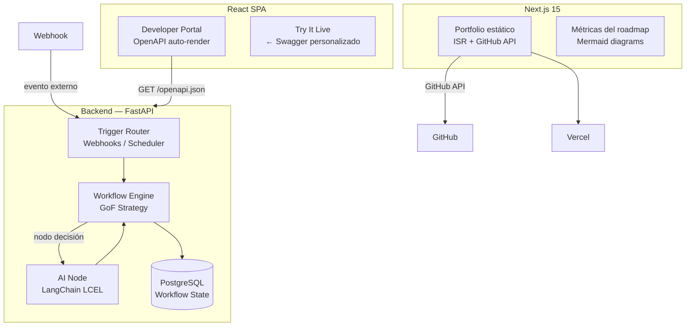

# 🏆 AutoPlatform

> Motor de automatización de workflows con IA al estilo Zapier, exposición vía API Marketplace auto-generado, portfolio personal en Vercel y contribución documentada a open source.

[](.)
[](.)
[](.)

---

## 🎯 Visión general

AutoPlatform es el proyecto integrador del roadmap. Une lo aprendido en 4 meses en un producto real de múltiples capas:

| Módulo | Lo que integra | Qué demuestra |
|--------|---------------|--------------|
| **AutomateAI Engine** | LangChain + FastAPI + GoF Strategy | Motor de workflows con nodos de decisión IA |
| **APIMarket** | React + OpenAPI auto-gen | Directorio interactivo de APIs (tipo developer portal) |
| **PortfolioOS** | Next.js + Vercel | Portfolio desplegado integrando feed de GitHub |
| **OpenContrib** | OSS, Git avanzado | PR real a una librería open source |
| **Retrospectiva** | ADRs + Mermaid + métricas | Documentación técnica del roadmap completo |

---

## 🛠️ Tecnologías principales

| Categoría | Tecnología | Versión objetivo |
|-----------|-----------|-----------------|
| Backend Engine | FastAPI + SQLAlchemy 2.0 async | — |
| IA / LLM Chain | LangChain LCEL + `ChatOpenAI` | 0.3+ |
| Frontend Marketplace | React 19 + TanStack Router | — |
| Portfolio | Next.js 15 (App Router) | — |
| Deploy | Vercel + GitHub Actions | — |
| Patrones GoF | Strategy, Command, Observer | — |
| API docs auto-gen | FastAPI `/openapi.json` → custom React UI | — |

---

## 🏗️ Arquitectura



### Workflow Engine con Strategy Pattern

```python
from abc import ABC, abstractmethod
from typing import Any

# Interfaz del nodo de workflow (GoF Strategy)
class WorkflowNode(ABC):
    @abstractmethod
    async def execute(self, context: dict[str, Any]) -> dict[str, Any]:
        """Ejecuta el nodo y retorna el contexto enriquecido."""
        ...

class AIClassifierNode(WorkflowNode):
    """Nodo que usa LLM para clasificar y decidir el siguiente paso."""

    def __init__(self, prompt_template: str, llm_model: str = "gpt-4.1-mini"):
        from langchain_openai import ChatOpenAI
        from langchain_core.output_parsers import StrOutputParser
        from langchain_core.prompts import ChatPromptTemplate

        # Cadena LCEL: prompt → llm → parser
        self._chain = (
            ChatPromptTemplate.from_template(prompt_template)
            | ChatOpenAI(model=llm_model)
            | StrOutputParser()
        )

    async def execute(self, context: dict[str, Any]) -> dict[str, Any]:
        result = await self._chain.ainvoke(context)
        return {**context, "ai_decision": result}


class WorkflowEngine:
    """Orquesta la ejecución secuencial de nodos encadenados."""

    def __init__(self, nodes: list[WorkflowNode]):
        self._nodes = nodes

    async def run(self, initial_context: dict[str, Any]) -> dict[str, Any]:
        context = initial_context
        for node in self._nodes:
            context = await node.execute(context)
        return context
```

### Next.js 15 — Portfolio con ISR y GitHub API

```typescript
// app/page.tsx — Incremental Static Regeneration cada hora
import { Octokit } from "@octokit/rest";

const octokit = new Octokit({ auth: process.env.GITHUB_TOKEN });

export const revalidate = 3600; // ISR

async function fetchPortfolioRepos() {
  const { data } = await octokit.repos.listForAuthenticatedUser({
    sort: "updated",
    per_page: 10,
  });
  return data;
}

export default async function HomePage() {
  const repos = await fetchPortfolioRepos();
  return <ProjectGrid repos={repos} />;
}
```

---

## ✅ Definition of Done

- [ ] **Workflow Engine**: al menos 4 tipos de nodos (HTTP Request, AI Classifier, Data Transform, Notifier)
- [ ] **Trigger vía webhook**: `POST /workflows/{id}/trigger` con validación de firma HMAC
- [ ] **APIMarket**: portal React que auto-renderiza el `openapi.json` de AutomateAI con "Try It" funcional
- [ ] **Portfolio desplegado**: URL pública en Vercel con dominio propio (o `*.vercel.app`)
- [ ] **ISR + GitHub feed**: repos del roadmap listados con stars, descripción y último commit
- [ ] **PR a OSS**: Pull Request real mergeado (o en revisión) en un proyecto conocido
- [ ] **ADR final**: `docs/adr/` con las 10 decisiones técnicas más importantes del roadmap
- [ ] **Retrospectiva**: métricas (proyectos, commits, tests, líneas de código) + diagramas Mermaid de cada arquitectura

---

## 📐 Endpoints principales

```
# Workflow Engine
POST   /workflows                → Crear workflow (DAG de nodos)
GET    /workflows                → Listar workflows
POST   /workflows/{id}/trigger   → Disparar ejecución por webhook
GET    /workflows/{id}/runs      → Historial de ejecuciones
GET    /workflows/{id}/runs/{rid} → Detalle de una ejecución

# Developer Portal
GET    /openapi.json             → Spec OpenAPI auto-generada (FastAPI)

# Portfolio (Next.js — serverless)
GET    /                         → Home: lista proyectos del roadmap
GET    /projects/{slug}          → Detalle de un proyecto (ADRs, métricas)
GET    /api/metrics              → Endpoint Next.js: métricas del roadmap
```

---

## 🗄️ Esquema de base de datos

```sql
CREATE TABLE workflows (
    id          UUID PRIMARY KEY DEFAULT gen_random_uuid(),
    name        TEXT NOT NULL,
    description TEXT,
    config      JSONB NOT NULL,   -- definición de nodos como JSON
    owner_id    UUID NOT NULL,
    active      BOOL DEFAULT true,
    created_at  TIMESTAMPTZ DEFAULT now()
);

CREATE TABLE workflow_runs (
    id           UUID PRIMARY KEY DEFAULT gen_random_uuid(),
    workflow_id  UUID REFERENCES workflows(id) ON DELETE CASCADE,
    trigger_data JSONB,
    final_ctx    JSONB,           -- contexto final tras todos los nodos
    status       TEXT CHECK (status IN ('running', 'success', 'failed')),
    started_at   TIMESTAMPTZ DEFAULT now(),
    finished_at  TIMESTAMPTZ
);

CREATE TABLE node_executions (
    id          UUID PRIMARY KEY DEFAULT gen_random_uuid(),
    run_id      UUID REFERENCES workflow_runs(id) ON DELETE CASCADE,
    node_index  INT NOT NULL,
    node_type   TEXT NOT NULL,
    input_ctx   JSONB,
    output_ctx  JSONB,
    error       TEXT,
    duration_ms INT
);
```

---

<details>
<summary>📚 Referencias de documentación usada</summary>

- [LangChain LCEL — ainvoke async](https://docs.langchain.com/oss/python)
- [FastAPI — OpenAPI auto-generation](https://fastapi.tiangolo.com/tutorial/metadata/)
- [Next.js 15 — ISR (revalidate)](https://nextjs.org/docs/app/building-your-application/data-fetching/incremental-static-regeneration)
- [GoF Strategy Pattern](https://refactoring.guru/design-patterns/strategy)
- [Octokit.js — GitHub API](https://github.com/octokit/rest.js)

</details>
