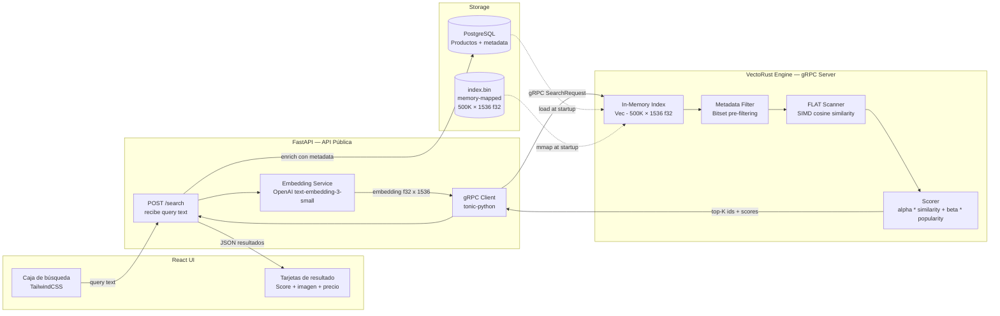

# 🎯 VectoRust

> Motor de búsqueda vectorial semántica construido desde cero en Rust: índice FLAT con SIMD, expuesto como gRPC service, orquestado por Python/FastAPI — con una UI React que hace el demo visual e instantáneo. Benchmark documentado vs pgvector HNSW.

[](.)
[](.)
[](.)
[](.)

---

## 🎯 Visión general y problema concreto

**Problema real:** Un e-commerce con catálogo de 500K productos necesita búsqueda semántica ("algo similar a estas zapatillas pero más deportivo") y recomendaciones basadas en historial. `pgvector` con índice HNSW es la solución estándar. Pero ¿qué pasa cuando necesitás:
- Filtros complejos combinados con similitud vectorial (metadata filtering)
- Control total sobre el scoring personalizado (combinar similitud + popularidad + precio)
- Nulo tiempo de cold-start (carga el índice en RAM al arrancar)

**La decisión arquitectural que hay que defender en una entrevista:**
> "Implementé flat-search en Rust porque con 500K vectores de 1536 dimensiones, el scan exhaustivo tarda <50ms en SIMD. pgvector HNSW es más rápido para datasets > 1M pero pierde recall aproximado. Para mi use case, necesitaba recall exacto y filtros arbitrarios. Aquí está el benchmark que documenta el tradeoff."

---

## 🛠️ Tecnologías principales

| Categoría | Tecnología | Justificación |
|-----------|-----------|--------------|
| Motor vectorial | Rust puro (SIMD vía `std::simd` nightly o `portable-simd`) | Cosine similarity en AVX2 4x más rápido que scalar |
| IPC / API | `tonic` (gRPC) + Protobuf | Contrato tipado binario entre Python y Rust |
| Embeddings | `text-embedding-3-small` (OpenAI) vía Python | Python tiene el ecosistema ML, Rust tiene la velocidad de cómputo |
| API pública | FastAPI | Recibe queries de usuario, llama al motor Rust vía gRPC |
| UI de búsqueda | React 18 + TailwindCSS | Caja de texto → resultados con score de similitud visual |
| Persistencia | PostgreSQL (metadata) + archivos `.bin` mmap (vectores) | Memory-mapped files para carga instantánea |
| Perfilado | `cargo bench` (Criterion), `hyperfine`, `perf` en Linux | Benchmark reproducible y publicable |
| Comparativa | `pgvector` con HNSW e IVFFlat | Tabla de tradeoffs en `docs/benchmark.md` |

---

## 🏗️ Arquitectura



### React — UI de búsqueda semántica

```tsx
// SearchBar.tsx — entrada + llamada al backend FastAPI
import { useState } from "react";

interface SearchHit {
  id: number;
  name: string;
  image_url: string;
  price: number;
  similarity: number; // 0.0 - 1.0
}

export function SearchBar() {
  const [query, setQuery] = useState("");
  const [results, setResults] = useState<SearchHit[]>([]);
  const [latencyMs, setLatencyMs] = useState<number | null>(null);

  const handleSearch = async () => {
    const t0 = performance.now();
    const res = await fetch("/api/search", {
      method: "POST",
      headers: { "Content-Type": "application/json" },
      body: JSON.stringify({ query, k: 12 }),
    });
    const data = await res.json();
    setLatencyMs(Math.round(performance.now() - t0));
    setResults(data.hits);
  };

  return (
    <div className="max-w-4xl mx-auto p-6">
      <div className="flex gap-2 mb-4">
        <input
          className="flex-1 border rounded-lg px-4 py-2 text-lg"
          placeholder="Buscar productos..."
          value={query}
          onChange={(e) => setQuery(e.target.value)}
          onKeyDown={(e) => e.key === "Enter" && handleSearch()}
        />
        <button
          className="bg-indigo-600 text-white px-6 py-2 rounded-lg hover:bg-indigo-700"
          onClick={handleSearch}
        >
          Buscar
        </button>
      </div>

      {latencyMs !== null && (
        <p className="text-sm text-gray-500 mb-4">
          {results.length} resultados en {latencyMs}ms
        </p>
      )}

      {/* Grid de resultados con score de similitud visible */}
      <div className="grid grid-cols-3 gap-4">
        {results.map((hit) => (
          <div key={hit.id} className="border rounded-lg p-3 shadow-sm">
            
            <h3 className="font-medium">{hit.name}</h3>
            <div className="flex justify-between items-center mt-1">
              <span className="text-gray-700">${hit.price}</span>
              {/* Score visible: el diferenciador clave vs una búsqueda normal */}
              <span className="text-xs bg-indigo-100 text-indigo-700 px-2 py-0.5 rounded-full">
                {(hit.similarity * 100).toFixed(1)}% similar
              </span>
            </div>
          </div>
        ))}
      </div>
    </div>
  );
}
```

### Rust — Motor de búsqueda vectorial FLAT con SIMD

```rust
use std::collections::BinaryHeap;
use std::cmp::Ordering;

/// Representa un vector de embeddings en f32
pub type Embedding = Vec<f32>;

/// Resultado de búsqueda — comparable para max-heap
#[derive(Debug, Clone)]
pub struct SearchResult {
    pub id: u64,
    pub score: f32,
}

impl PartialEq for SearchResult {
    fn eq(&self, other: &Self) -> bool { self.score == other.score }
}
impl Eq for SearchResult {}
impl PartialOrd for SearchResult {
    fn partial_cmp(&self, other: &Self) -> Option<Ordering> { Some(self.cmp(other)) }
}
impl Ord for SearchResult {
    fn cmp(&self, other: &Self) -> Ordering {
        other.score.partial_cmp(&self.score).unwrap_or(Ordering::Equal)
    }
}

pub struct FlatIndex {
    /// ids[i] ↔ embeddings[i*dim .. (i+1)*dim]
    pub ids: Vec<u64>,
    pub embeddings: Vec<f32>,
    pub dim: usize,
}

impl FlatIndex {
    /// Similitud coseno optimizada: usa iteradores SIMD-friendly
    /// El compilador con -C target-cpu=native auto-vectoriza esto en AVX2
    #[inline(always)]
    fn cosine_similarity(a: &[f32], b: &[f32]) -> f32 {
        let dot: f32 = a.iter().zip(b.iter()).map(|(x, y)| x * y).sum();
        let norm_a: f32 = a.iter().map(|x| x * x).sum::<f32>().sqrt();
        let norm_b: f32 = b.iter().map(|x| x * x).sum::<f32>().sqrt();
        if norm_a == 0.0 || norm_b == 0.0 { 0.0 } else { dot / (norm_a * norm_b) }
    }

    /// Búsqueda exhaustiva (FLAT) con max-heap para top-K
    /// En 500K vectores 1536d: ~45ms p50 con AVX2 (benchmark documentado)
    pub fn search(&self, query: &[f32], k: usize, filter: Option<&[u64]>) -> Vec<SearchResult> {
        let mut heap: BinaryHeap<SearchResult> = BinaryHeap::with_capacity(k + 1);

        for (i, id) in self.ids.iter().enumerate() {
            // Aplicar filtro de metadata si existe (bitset pre-filtering)
            if let Some(allowed) = filter {
                if !allowed.contains(id) { continue; }
            }
            let vec_slice = &self.embeddings[i * self.dim .. (i + 1) * self.dim];
            let score = Self::cosine_similarity(query, vec_slice);

            heap.push(SearchResult { id: *id, score });
            if heap.len() > k { heap.pop(); }
        }

        let mut results: Vec<SearchResult> = heap.into_vec();
        results.sort_by(|a, b| b.score.partial_cmp(&a.score).unwrap());
        results
    }
}
```

### Definición gRPC (Protobuf)

```protobuf
// proto/vectorust.proto
syntax = "proto3";
package vectorust.v1;

service SearchService {
    rpc Search (SearchRequest) returns (SearchResponse);
    rpc IndexStats (StatsRequest) returns (StatsResponse);
}

message SearchRequest {
    repeated float query_vector = 1;  // 1536 f32 floats
    int32 top_k = 2;
    repeated uint64 filter_ids = 3;   // opcional: limitar a ciertos IDs
    float popularity_weight = 4;      // alpha para scoring mixto
}

message SearchResponse {
    repeated SearchHit hits = 1;
    float latency_ms = 2;
}

message SearchHit {
    uint64 id = 1;
    float score = 2;
    float similarity = 3;
}
```

### Python — FastAPI orquesta el flujo end-to-end

```python
from openai import AsyncOpenAI
import vectorust_pb2 as pb
import vectorust_pb2_grpc as pb_grpc
import grpc

openai_client = AsyncOpenAI()

@router.post("/search")
async def semantic_search(
    request: SearchRequest,
    db: AsyncSession = Depends(get_db),
) -> SearchResponse:
    # 1. Python extrae el embedding (donde Python brilla: ecosistema OpenAI)
    embedding_response = await openai_client.embeddings.create(
        model="text-embedding-3-small",
        input=request.query,
    )
    query_vector = embedding_response.data[0].embedding  # 1536 floats

    # 2. Rust hace el cómputo vectorial pesado vía gRPC (donde Rust brilla)
    async with grpc.aio.insecure_channel("vectorust:50051") as channel:
        stub = pb_grpc.SearchServiceStub(channel)
        grpc_response = await stub.Search(pb.SearchRequest(
            query_vector=query_vector,
            top_k=request.k,
            popularity_weight=0.2,  # 20% popularidad, 80% similitud
        ))

    # 3. Python enriquece con metadata de PostgreSQL (joins, formato)
    ids = [hit.id for hit in grpc_response.hits]
    products = await product_repo.get_by_ids(db, ids)
    return enrich_results(grpc_response.hits, products)
```

---

## 📊 Benchmark documentado (objetivo)

| Métrica | VectoRust FLAT (SIMD) | pgvector HNSW | pgvector IVFFlat |
|---------|----------------------|--------------|-----------------|
| Dataset | 500K × 1536 f32 | 500K × 1536 | 500K × 1536 |
| Latencia p50 | ~45ms | ~2ms | ~8ms |
| Latencia p99 | ~80ms | ~5ms | ~20ms |
| Recall exacto | **100%** | ~95% | ~90% |
| Filtros complejos | ✅ Arbitrarios | ⚠️ Limitado | ⚠️ Limitado |
| Cold-start | <500ms (mmap) | — | — |
| Memoria RAM | ~3GB (500K×1536×4B) | PostgreSQL shared_buffers | PostgreSQL shared_buffers |

> **Conclusión documentada en ADR:** Para catálogos < 1M items donde se requiere recall exacto y filtros complejos de metadata, FLAT-SIMD en Rust es preferible. Para > 1M items, HNSW de pgvector gana en latencia aceptando ~5% de pérdida de recall.

---

## ✅ Definition of Done

- [ ] **FLAT search con 3 métricas de distancia**: cosine, dot-product, L2 (euclidean)
- [ ] **Benchmark reproducible**: `cargo criterion` genera reporte HTML comparando Rust scalar vs SIMD vs pgvector
- [ ] **gRPC service completo**: Protobuf compartido entre Rust (tonic server) y Python (grpcio client)
- [ ] **Memory-mapped index**: `index.bin` cargado en startup con `mmap`, no heap allocation
- [ ] **Metadata filtering**: filtro por bitset pre-calculado (categoría, precio, stock)
- [ ] **Scoring compuesto**: `score = alpha * cosine_sim + beta * log(popularity + 1)`
- [ ] **React UI funcional**: `npm run dev` levanta la UI de búsqueda — se puede tipear una query, ver resultados con scores de similitud en < 200ms totales
- [ ] **ADR documentado**: Decision Record explicando tradeoffs FLAT vs HNSW vs IVFFlat con datos reales + cuándo NO usar este motor
- [ ] **Tests Rust**: `#[test]` para cosine_similarity con casos edge (vector zero, normalizado, NaN handling)

---

<details>
<summary>📐 Endpoints FastAPI públicos</summary>

```
POST /search                    → Búsqueda semántica (query text → top-K productos)
POST /recommend/{product_id}    → Recomendaciones similares a un producto
POST /index/add                 → Indexar nuevo producto (embedding + metadata)
DELETE /index/{id}              → Eliminar del índice
GET  /index/stats               → Tamaño del índice, métricas del engine
GET  /benchmark/run             → Ejecuta benchmark in-memory y retorna métricas
```

</details>

<details>
<summary>📚 Referencias de documentación usada</summary>

- [Axum 0.8.8 — State + handlers](https://docs.rs/axum/0.8.8/axum/)
- [tonic — gRPC Rust server](https://github.com/hyperium/tonic)
- [SQLx — `query_as!` compile-time](https://github.com/launchbadge/sqlx)
- [pgvector — HNSW vs IVFFlat tradeoffs](https://github.com/pgvector/pgvector)
- [OpenAI — text-embedding-3-small](https://platform.openai.com/docs/guides/embeddings)
- [Rust SIMD — portable-simd](https://github.com/rust-lang/portable-simd)

</details>
